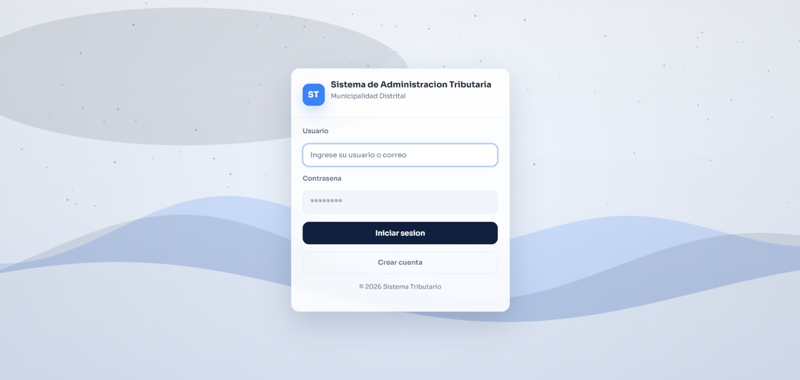
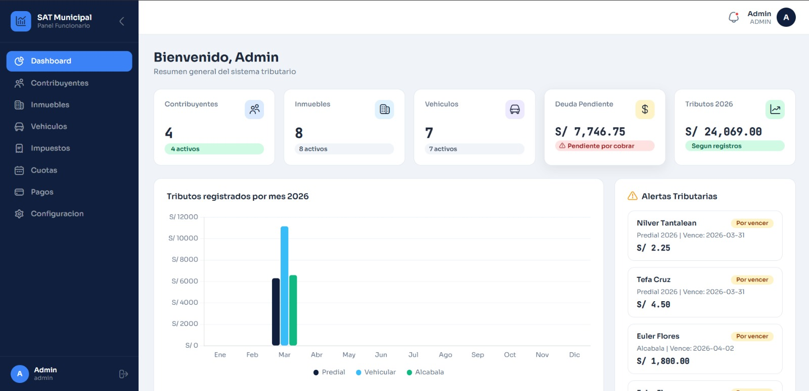
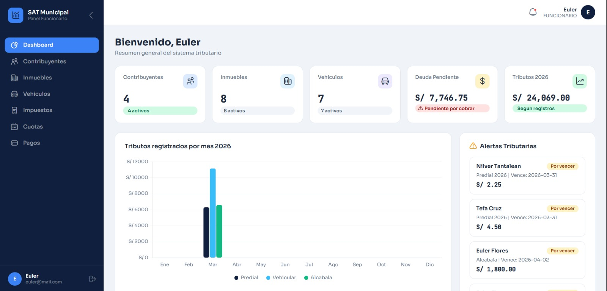
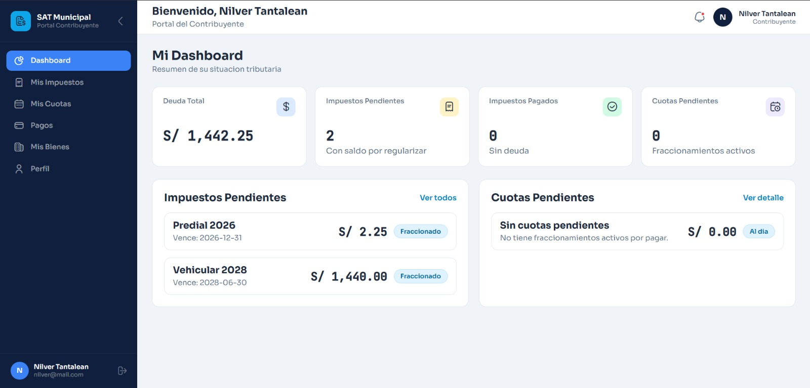

# Sistema de Administracion Tributaria

Aplicacion web para la gestion de contribuyentes, bienes e impuestos municipales.

## Stack
- Java 21
- Maven (WAR)
- Jakarta Servlet 6 + JSP/JSTL
- JPA 3.1 + Hibernate 6
- MySQL 8

## Funcionalidades
- Autenticacion y control de acceso por rol (`ADMIN`, `FUNCIONARIO`, `CONTRIBUYENTE`).
- Modulo de funcionario: dashboard, contribuyentes, inmuebles, vehiculos, impuestos (vehicular/predial/alcabala), cuotas y configuracion.
- Modulo de contribuyente: dashboard, cuotas, pagos, bienes y perfil.

## Actores
- `ADMIN`: gestiona configuracion general y cuentas internas.
- `FUNCIONARIO`: opera padrones, bienes, impuestos y cuotas.
- `CONTRIBUYENTE`: consulta su estado tributario, pagos, bienes y perfil.

## Capturas
### Login


### Admin


### Funcionario


### Contribuyente


## Estructura
- `tributo/src/main/java`: controladores, servicios, DAO, entidades y filtros.
- `tributo/src/main/webapp/views`: vistas JSP por modulo.
- `tributo/src/main/resources/META-INF/persistence.xml`: configuracion JPA/MySQL.
- `tributo/database/sql_final/tributaria.sql`: script base completo con datos de prueba.
- `tributo/database/sql/*.sql`: migraciones incrementales.

## Requisitos
- JDK 21
- Maven 3.9+
- MySQL 8+
- Apache Tomcat 10.1+ (Jakarta EE)

## Ejecucion local
1. Ejecuta `tributo/database/sql_final/tributaria.sql` en MySQL.
2. Ajusta usuario/clave en `tributo/src/main/resources/META-INF/persistence.xml`.
3. Compila el proyecto:
   ```bash
   mvn -f tributo/pom.xml clean package
   ```
4. Despliega `tributo/target/tributo.war` en Tomcat.
5. Abre `http://localhost:8080/tributo/login`.

## Estado de build
- Compilacion verificada con `mvn -f tributo/pom.xml -DskipTests package`.
